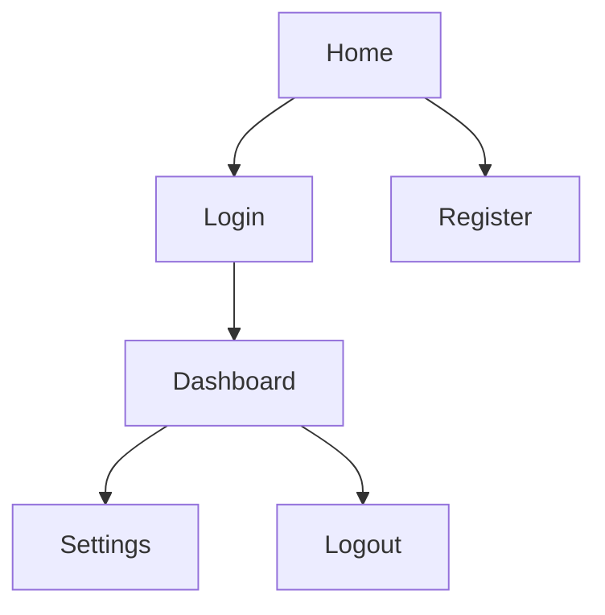
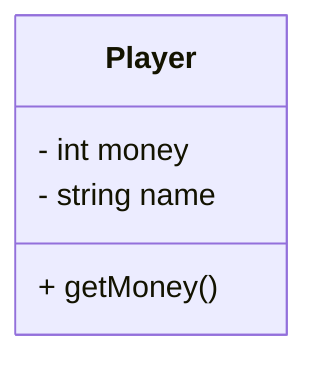

# Project Documentation

Welcome to the project documentation! This folder contains all design and user experience resources, including wireframes, navigation flows, and technical notes.

---

## 📑 Table of Contents
- [Project Documentation](#project-documentation)
  - [📑 Table of Contents](#-table-of-contents)
  - [🖼 Wireframes](#-wireframes)
  - [🔀 User Flows](#-user-flows)
  - [🧩 UML Class Diagrams](#-uml-class-diagrams)
  - [⚙️ Technical Documentation](#️-technical-documentation)
  - [📂 Folder Structure](#-folder-structure)
  - [✏️ Editing \& Export Tips](#️-editing--export-tips)

---

## 🖼 Wireframes
Wireframes represent the layout and structure of each screen in the app.  
Sources are stored in `docs/wireframes/` (in `.fig` or `.drawio` format) and exported versions in PNG/PDF for quick access.

- **Home Screen** → `wireframes/exports/home.png`  
- **Login Screen** → `wireframes/exports/login.png`  
- **Dashboard** → `wireframes/exports/dashboard.png`

> Keep both the editable source files and the exported images in the repo so they’re easy to update and to review in PRs.

---

## 🔀 User Flows
User flows describe how users navigate between pages.  
We use Mermaid diagrams inside Markdown files so GitHub can render them.

Example navigation flow (save this in `ux_flows/navigation_flow.md`):



> Tip: You can create multiple flows (onboarding, main loop, settings) as separate `.md` files.

---

## 🧩 UML Class Diagrams
To keep track of the game’s architecture and relationships between systems, UML diagrams are included. Mermaid diagrams are also used for this issue.

Example : 


---

## ⚙️ Technical Documentation
This section is for architecture notes, technical decisions, and setup guides.  
See `architecture.md` for details (build targets, CI/CD, test strategy, styling rules, etc.).

---

## 📂 Folder Structure
```
docs/
 ├── wireframes/
 │    ├── *.fig / *.drawio   (source files)
 │    └── exports/           (PNG / PDF exports)
 ├── ux_flows/
 │    ├── *.md               (Mermaid diagrams)
 │    └── *.png              (optional image exports)
 ├── uml/ 
 │    └── *.fig / *.drawio   (class diagrams)
 ├── architecture.md
 └── README.md               (this file)
```

---

## ✏️ Editing & Export Tips
- **draw.io (diagrams.net)**: ideal for versioning directly in Git; save `.drawio` and also export PNG for quick viewing.  
- **Mermaid**: use code fences with `mermaid` in `.md` files; GitHub renders them automatically.  
- **Naming**: prefer `screen-name_v1.fig`, `screen-name.drawio`, `screen-name.png` for clarity.  
- **Reviews**: link to images/flows from PR descriptions so reviewers can quickly see UI changes.
